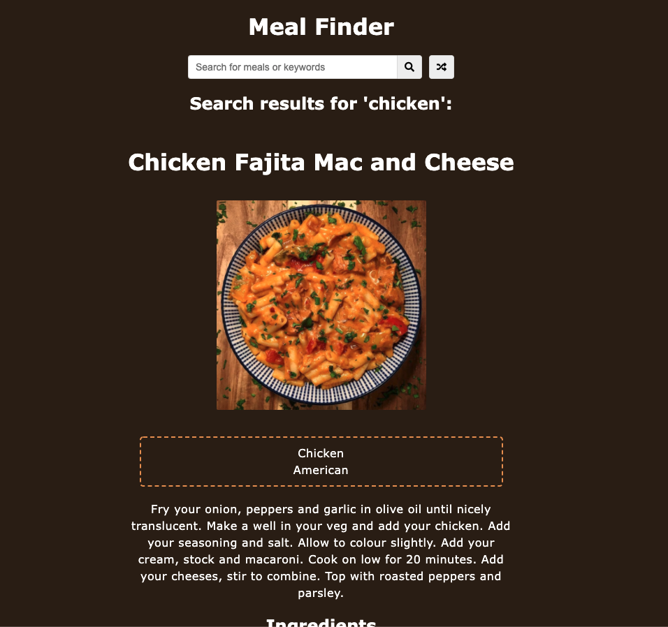

# Meal Finder

## https://long-breeze-7349.on.fleek.co/

### Description:

Meal Finder is a web app for users who are looking for what to eat. It uses the Meal DB api and allows the user to input an ingredient or dish name to get a list of potential meals. When they click on the meal it will display the recipe and ingredients. It also has a random meal button in case you are not sure what to eat.
